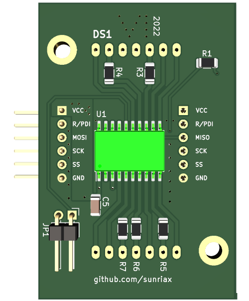

[](https://github.com/sunriax) [](https://www.gnu.org/licenses/gpl-3.0)

# . Matrix Display Controller

[](https://raw.githubusercontent.com/sunriax/.matrix/main/matrix.png)

The MDC (Matrix Display Controller) is to interact with a dot matrix display (like the [Kingbright TA20](https://at.rs-online.com/web/p/led-displays/4516650?sra=pmpn)) over `SPI` bus or `UART` (See the command list below).

# Board

| Download | Description |
|-------|:------:|
| [Schematic](https://cadlab.io/project/25253/main/circuit/UENCL21hdHJpeC5raWNhZF9zY2g%3D) | Complete Schematic of the Display|
| [KiCAD](https://cadlab.io/project/25253/main/circuit/UENCL21hdHJpeC5raWNhZF9wY2I%3D) | KiCAD files |
| [Gerber](https://cadlab.io/project/25253/main/circuit/UENCL21hdHJpeC5raWNhZF9wY2I%3D) | Gerber production and drill files |

## 3D Model

| TOP | BOT |
|-----|-----|
|  |  | 

## Agenda

| Board | Status |
|-------|:------:|
| [Schematic](https://cadlab.io/project/25253/main/circuit/UENCL21hdHJpeC5raWNhZF9zY2g%3D) | ✔️ Done |
| [Board](https://cadlab.io/project/25253/main/circuit/UENCL21hdHJpeC5raWNhZF9wY2I%3D) | ✔️ Done |
| [Partlist](./PCB/docs/partlist.csv) | ✔️ Done |
| Production | ✔️ Done |
| [Assembly](pcb.png) | ✔️ Done |
| Case | ❌ Open |

# Firmware [](https://app.travis-ci.com/github/sunriax/.matrix)

| Image                      | Download |
|----------------------------|----------|
| Display | [zip](https://github.com/sunriax/.matrix/releases/latest/download/matrix-firmware.zip) / [tar.gz](https://github.com/sunriax/.matrix/releases/latest/download/matrix-firmware.tar.gz) |
| Demo (ATmega16) | [zip](https://github.com/sunriax/.matrix/releases/latest/download/test-firmware-atmega16a.zip) / [tar.gz](https://github.com/sunriax/.matrix/releases/latest/download/test-firmware-atmega16a.tar.gz) |


# Display

The display can be driven in two modes either the standard (`spi`) mode or the `uart` mode.

## SPI mode

The display can be controlled with the `matrix` library. The library can be found in the [TEST project](./Firmware/TEST/main.c). The library is modular and can be adapted onto other plattforms. For platform adaptions the `spi` library has to be rewritten for the target platform. Currently the library can be used with an `ATmega16A`.

### Startup

``` c
// User libraries
#include "matrix/matrix.h"

// ...
int main(void)
{
	matrix_init();
	_delay_ms(1000);
	matrix_clear_all();
	_delay_ms(1000);
}
```

### Standard commands

| Command                       | Description                                    |
|-------------------------------|------------------------------------------------|
| `matrix_init()`               | Initializes the display                        |
| `matrix_buffer(0-255, ARRAY)` | Send an array (5*7) bits to a specific display |
| `matrix_buffer_all(ARRAY)`    | Send an array (5*7) bits to all displays       |
| `matrix_char(0-255, ASCII)`   | Send an ASCII char to a specific display       |
| `matrix_string(STRING)`       | Send an ASCII string to a all display          |
| `matrix_clear(0-255)`         | Clear a specific display                       |
| `matrix_clear_all()`          | Clear all displays                             |

### Speical commands

| Define                 | VALUE   | Description                |
|------------------------|---------|----------------------------|
| `MATRIX_EEPROM_CHAR0`  | `0x00`  | EEPROM address of MEMORY 0 |
| `MATRIX_EEPROM_CHAR0`  | `0x01`  | EEPROM address of MEMORY 1 |
| ...                    | ...     | ...                        |
| `MATRIX_EEPROM_CHAR0`  | `0x0E`  | EEPROM address of MEMORY E |
| `MATRIX_EEPROM_CHAR0`  | `0x0F`  | EEPROM address of MEMORY F |

| Command                                   | Description                                    |
|-------------------------------------------|------------------------------------------------|
| `matrix_prom_write(0-255, DEFINE, ARRAY)` | Save an array (5*7) to the display EEPROM      |
| `matrix_prom_read(0-255, DEFINE)`         | Load an array from EEPROM to the display       |

### Example

``` c
// TEST Connection
//
//          uC                 DISPLAY 0              DISPLAY 1
//  ~~~~~~~~~~~~~~~~~+    +~~~~~~~~~~~~~~~~~+    +~~~~~~~~~~~~~~~~~+
//    A  (M)         |    |                 |    |                 |
//    T  (E)     VCC +----+ VCC         VCC +----+ VCC         VCC |
//    M  (G)         |    |                 |    |                 |
//    E  (A)    MOSI +----+ MOSI       MISO +----+ MOSI       MISO |
//    G  (C)     SCK +----+ SCK         SCK +----+ SCK         SCK |
//    A  (A)      SS +----+ SS           SS +----+ SS           SS |
//    1  (R)     GND +----+ GND         GND +----+ GND         GND |
//    6  (D)         |    |                 |    |                 |
//    A              |    +~~~~~~~~~~~~~~~~~+    +~~~~~~~~~~~~~~~~~+
//  ~~~~~~~~~~~~~~~~~+

#define F_CPU 12000000UL    // System clock (required for delay)

// System libraries
#include <avr/io.h>
#include <util/delay.h>

// User libraries
#include "matrix/matrix.h"

// ...
int main(void)
{
	matrix_init();
	_delay_ms(1000);
	matrix_clear_all();
	_delay_ms(1000);

    unsigned char buffer[] = {
		0b01000,
		0b01000,
		0b01000,
		0b01000,
		0b01000,
		0b01000,
		0b11111
	}; 

    // Send buffer to display 0
    matrix_buffer(0, buffer);
	_delay_ms(1000);

    // Send buffer to all displays
    matrix_buffer_all(buffer);
	_delay_ms(1000);

    // Send ASCII char to display 0
    matrix_char(0, 'A');
	_delay_ms(1000);

    // Send string to displays
    matrix_string(0, "TEST");
	_delay_ms(1000);

    // Clear display 0
    matrix_clear(0);
	_delay_ms(1000);

    // Clear all displays
    matrix_clear_all();
	_delay_ms(1000);

    // !!! Only one time necessary !!!
    // !!!!!!!!!!!!!!!!!!!!!!!!!!!!!!!!!!!!!!!!!!!!!!!!!!!
    // !!! Warning:                                    !!!
    // !!! Don´t call this function in a while(1) loop !!!
    // !!! This will damage the EEPROM                 !!!
    // !!!!!!!!!!!!!!!!!!!!!!!!!!!!!!!!!!!!!!!!!!!!!!!!!!!

    // Save buffer in display EEPROM
	matrix_prom_write(0, MATRIX_EEPROM_CHAR0, buffer);
	_delay_ms(1000);

    // Read data from EEPROM
    matrix_prom_read(0, MATRIX_EEPROM_CHAR0);
	_delay_ms(1000);
}
```

## UART mode

The standard ASCII characters can also be transferred to display over UART. Therefore a special configuration is necessary. Pin `SS` should be connected to ground (`GND`) before powering the display.

``` c
// TEST Connection
//
//           DISPLAY 0              USB/UART
//      +~~~~~~~~~~~~~~~~~+   +~~~~~~~~~~~~~~~~~+
//      |                 |   |                 |
//      + VCC         VCC +---+ VCC             |
//      |                 |   |             +---+
//      + MOSI       MISO +---+ TXD         | U |
//      + SCK         SCK +   |             | S |
//  +---+ SS           SS +   |             | B |
//  +---+ GND         GND +---+ GND         +---+
//      |                 |   |                 |
//      +~~~~~~~~~~~~~~~~~+   +~~~~~~~~~~~~~~~~~+
```

Characters can be sent to the display over [TeraTerm](https://osdn.net/projects/ttssh2/releases/) or [Putty](https://www.chiark.greenend.org.uk/~sgtatham/putty/latest.html)
`UART` should contain following setup:

| Parameter | Value |
|-----------|-------|
| Baudrate  | 9600  |
| Datasize  | 8 Bit |
| Parity    | None  |
| Stopbits  | 1     |